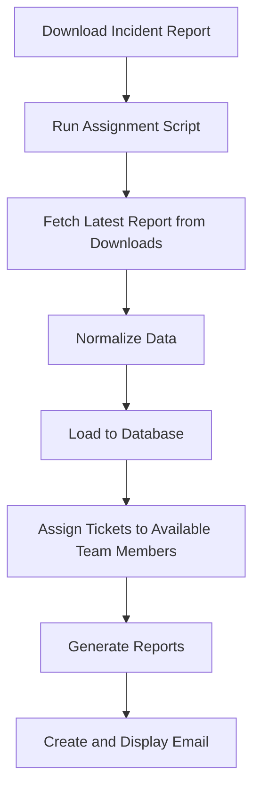
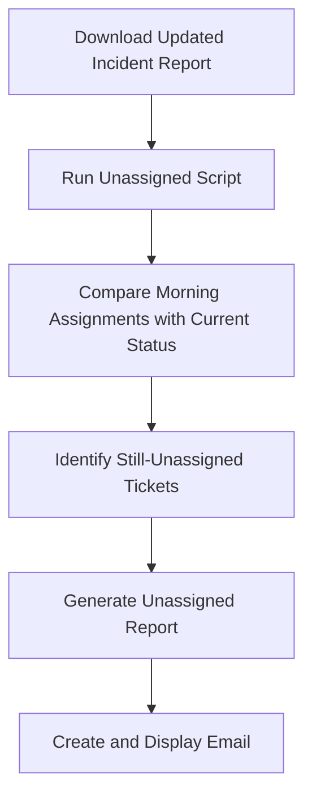

# INM.App.CLI - Ticket Assignment Tool

A streamlined command-line tool for automating the daily incident ticket assignment process for the SAP Basis Team at Linde.


## Overview

INM.App.CLI automates the daily workflow of assigning incident tickets to team members. It simplifies what would otherwise be a manual, time-consuming process by:

1. Automatically fetching the latest incident report from your Downloads folder
2. Distributing tickets evenly among available team members
3. Generating formatted reports for easy review
4. Sending notification emails with clickable ticket links
5. Tracking unassigned tickets that need attention

## Key Benefits

- **Time Savings**: Reduces manual ticket assignment from hours to minutes
- **Fair Distribution**: Ensures balanced workload across the team
- **Improved Visibility**: Provides clear reports of assigned and unassigned tickets
- **Accountability**: Tracks ticket assignments in a database for historical reference
- **Seamless Communication**: Automatically generates and sends formatted email notifications

## Quick Start Guide

### Prerequisites

- Windows operating system
- Microsoft Outlook installed
- Python 3.7 or higher

### Installation

```bash
# Clone the repository
git clone https://github.com/your-org/INM.App.CLI.git
# Navigate to the project directory
cd INM.App.CLI
# Install the package
pip install -e .
```

### Required Files

Place these Excel files in the `data` folder:

- **TEAM_MASTER.xlsx**: Contains the master list of all team members
- **TEAM_AVAIL.xlsx**: Lists team members and their availability status (available/leave)

### Daily Usage

#### Morning Assignment Process

1. Download the latest Incident report from SMAX as an Excel file
2. Run the assignment script:
   ```powershell
   bin\run_assign.bat
   ```
3. Review and send the automatically generated email

#### Afternoon Follow-up (Optional)

1. Download the latest Incident report from SMAX again
2. Run the unassigned tickets check:
   ```powershell
   bin\run_unassign.bat
   ```
3. Review and send the email showing tickets that remain unassigned

---

## How It Works

### Assignment Process



--- 

### Unassigned Ticket Check



## Command Reference

The tool provides several commands that can be run individually:

```bash
# Fetch the latest INM file from Downloads
ticket-assigner fetch-latest
# Normalize column names in the Excel file
ticket-assigner normalize-inm
# Load data to the database
ticket-assigner load-inm
# Assign tickets and generate reports
ticket-assigner assign
# Generate HTML report from Excel
ticket-assigner html
# Check for tickets that remain unassigned
ticket-unassigned
```

## Data Storage

All data is stored locally in a SQLite database (`data/ticket_assign.db`), which maintains:

- Historical record of all tickets processed
- Assignment history
- Unassigned ticket tracking

## Support

For questions or assistance, please contact:
- Sumit Das (sumit.das@linde.com)
